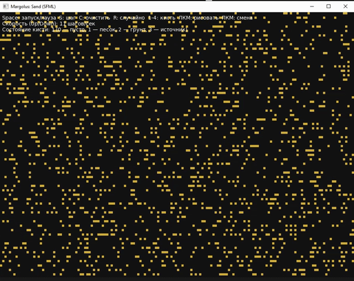

# Описание проекта

Программа демонстрирует работу клеточного автомата на основе блочной окрестности Марголуса.  
Реализовано визуальное демо с интерактивным управлением; визуализация выполнена с помощью SFML.

Анимация примера работы находится в папке `demo` и загружается как `demo/demo.gif`:

---

## Управление

- **Пробел** — запуск / пауза  
- **S** — выполнить один шаг  
- **C** — очистить поле  
- **R** — случайное заполнение  
- **1–4** — выбрать состояние кисти (0 — пусто, 1 — песок, 2 — грунт, 3 — источник)  
- **ЛКМ** — рисовать текущим состоянием кисти  
- **ПКМ** — циклически сменить состояние ячейки  
- **Стрелки ↑ / ↓** — увеличить / уменьшить скорость симуляции (шагов в секунду)

---

## Исполняемый файл

Готовая сборка расположена в папке `result`. В папке `result` находятся:

- исполняемый файл программы (`.exe` / бинарный файл для вашей ОС)  
- необходимые DLL-библиотеки SFML (если требуется для Windows)  
- шрифт с поддержкой кириллицы (например, `DejaVuSans.ttf`)

Чтобы запустить программу:
1. Откройте папку `result`.  
2. Дважды кликните по основному исполняемому файлу или запустите его из терминала/командной строки.  
3. Убедитесь, что рядом с исполняемым файлом присутствуют все необходимые DLL и шрифт.

## Благодарности

Автор выражает признательность за идею и вдохновение статье:  
**«Удивительные клеточные автоматы: блочные КА, окрестность Марголуса»** — https://habr.com/ru/companies/timeweb/articles/727016/

